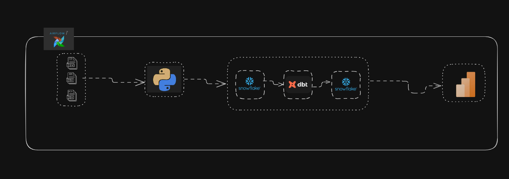
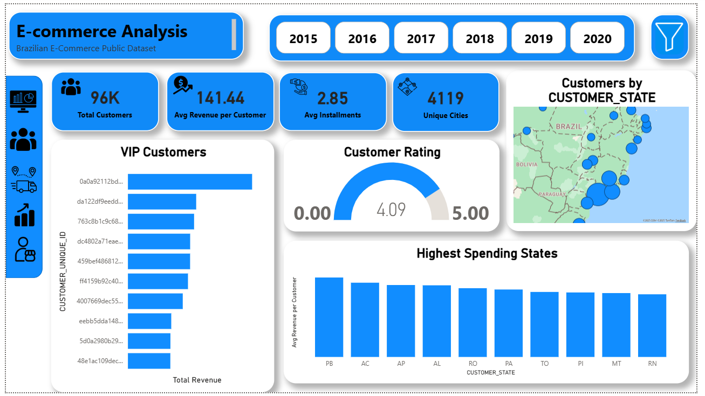
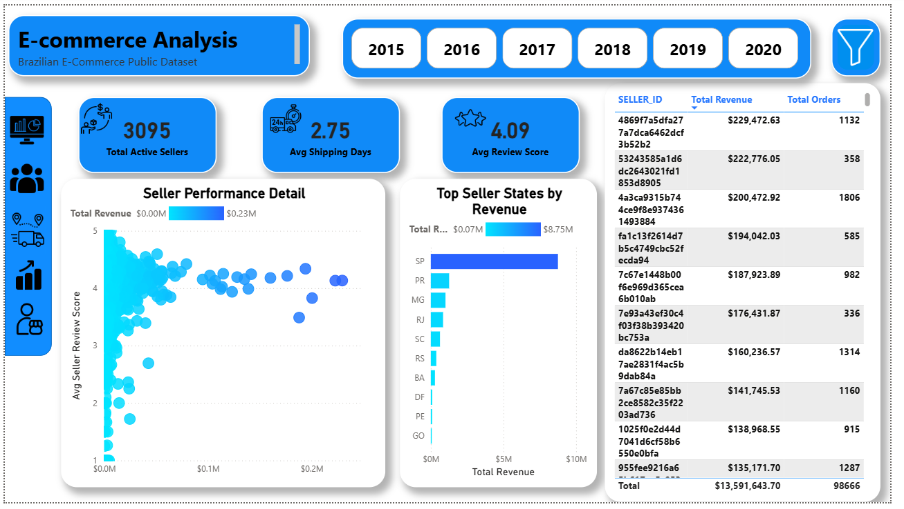

# 🛒 End-to-End Olist E-Commerce Analytics Project

## 📌 Project Overview
This project is a modern **ELT (Extract, Load, Transform)** data pipeline designed to analyze the Brazilian Olist E-Commerce dataset. The goal was to transform raw, scattered CSV files into a structured Data Warehouse to enable business intelligence reporting.

The solution leverages **Python** for initial data cleaning, **Snowflake** as a centralized Data Warehouse, and **dbt** for advanced data modeling, followed by **Power BI** for visualization.

## 🏗️ Pipeline Architecture
The data flows from raw files through a cleaning layer using Python, is loaded into Snowflake, and then transformed into a **Galaxy Schema** using dbt.



### 🔄 Data Flow Description:

#### 1. Ingestion & Cleaning (Python Layer)
* **Source:** Raw CSV files (Orders, Customers, Payments, etc.).
* **Processing:** **Python (Pandas)** scripts are used to:
    * Handle missing values and data types.
    * Clean string characters (e.g., city names).
    * Prepare data for loading.

#### 2. Data Warehousing (Snowflake)
* **Loading:** Cleaned data is loaded into **Snowflake** staging tables.
* **Storage:** Acts as the centralized repository for both raw and transformed data.

#### 3. Transformation & Modeling (dbt)
* **Transformation:** **dbt (Data Build Tool)** performs the "T" in ELT inside Snowflake.
* **Modeling:** Implemented a **Galaxy Schema** containing:
    * **Dimensions:** Customers, Products, Sellers, Time.
    * **Facts:** Sales, Payments, and Reviews.
* **Testing:** Applied dbt tests to ensure data quality (unique keys, not null constraints).

#### 4. Visualization (Power BI)
* **Connection:** Power BI connects directly to the Gold Layer in Snowflake.
* **Output:** Interactive dashboards for Sales, Logistics, and Seller analysis.


---
## 📊 Dashboard Gallery & Strategic Insights
Explore the interactive Power BI reports designed to drive strategic business decisions across all departments.

### 1️⃣ Executive Overview
*A centralized command center for C-level executives. This view provides a real-time pulse on Total Revenue ($13.59M), Orders, and Monthly Sales Trends to identify growth opportunities.*


### 2️⃣ Customer Segmentation & Behavior
*Understanding who buys what. This dashboard analyzes customer distribution by state, highlights VIP customers, and tracks average spending to tailor marketing campaigns.*


### 3️⃣ Sales & Product Performance
*Deep dive into product metrics. Analyzes Revenue by Category and Price vs. Quantity correlations to optimize inventory and pricing strategies.*


### 4️⃣ Logistics & Supply Chain Intelligence
*Tracking the order journey. This crucial view monitors Delivery Performance, identifies slowest shipping states, and breaks down the order lifecycle to reduce transit times.*


### 5️⃣ Seller Performance Matrix
*Evaluating marketplace partners. A strategic tool to classify sellers based on Revenue vs. Review Scores, helping admin teams manage seller quality effectively.*


---

## 🛠️ Tech Stack
| Category | Technologies |
| :--- | :--- |
| **Data Cleaning** | Python (Pandas) |
| **Data Warehouse** | Snowflake |
| **Transformation** | dbt (Data Build Tool) |
| **Visualization** | Power BI |
| **Languages** | Python, SQL, DAX |

---

## 🗂️ Project Structure
```text
├── 📂 Python_Scripts/       # Python scripts for cleaning & validation
├── 📂 dbt_Project/          # dbt models, snapshots, and schema tests
├── 📂 data modeling/        # Architecture diagram 
├── 📂 power_BI/             # Dashboard screenshots
└──README.md                # Project documentation

👨‍💻 Author
Ehab Farid

Role: Data Engineer

linledin : https://www.linkedin.com/in/ehab-fared-b822a6212/